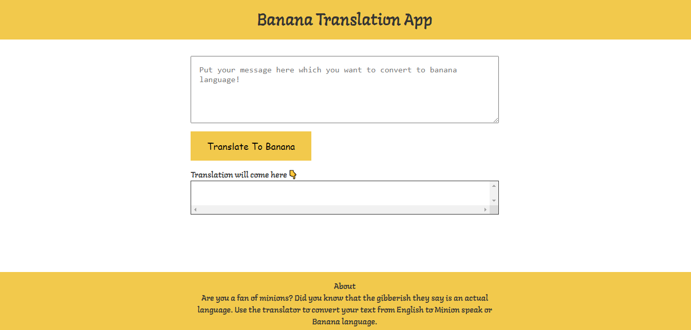
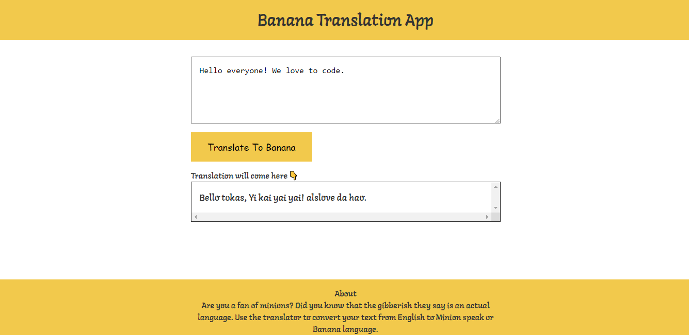

# Talk-Like-Banana 
### Hey everyone 👋 Bob is so happy to see you here!


Are you a fan of minions? Did you know that the gibberish they say is an actual language. Use this web app to convert your text from English to Minion speak or Banana language. What? Banana.
<br><br>

<br>
# Tech Stack

**Frontend:** HTML 

**Backend:** Javascript

**Styling:** CSS

# Development Environment Setup

- Install [git](https://git-scm.com/book/en/v2/Getting-Started-Installing-Git):
  <br/>

  ```
  sudo apt-get update
  sudo apt install git-all
  ```
# Banana Translation App
Now, let's find out, what do these yellow creatures actually speak.
<br><br>

<br><br>
The way Minions love banana, Coders love to code.<br>Let's get out this love of coding in banana language using this awesome Banana Translation App: 
<br><br>

<br><br>
Loved it? Of course! So, just try out this Banana Translation App right now!
<br><br>


#### Minions are glad you came here. Bye, Bye! 👋👋 Have a great day ahead.<br>
Don't forget to use Banana Language.<br>
With Bananas,<br>
Minions 💛
