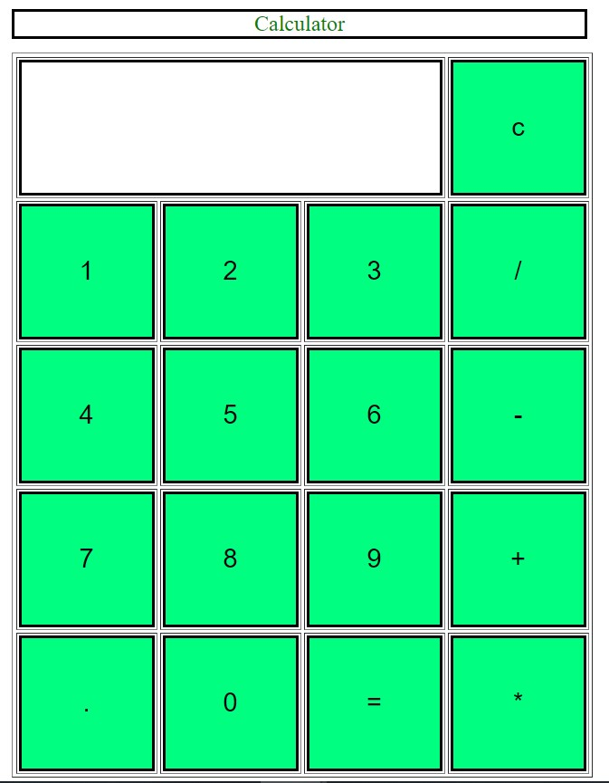

## Calculator

# Description

This is a web based calculator made from HTML, CSS& Javascript.
The user needs to click on the number buttons to select the digits and on operations button to select the operation (+, -, *, /).
When the '=' button is clicked, the ouput for the chosen operation on selected numbers will be displayed. 

# Demo Image 

