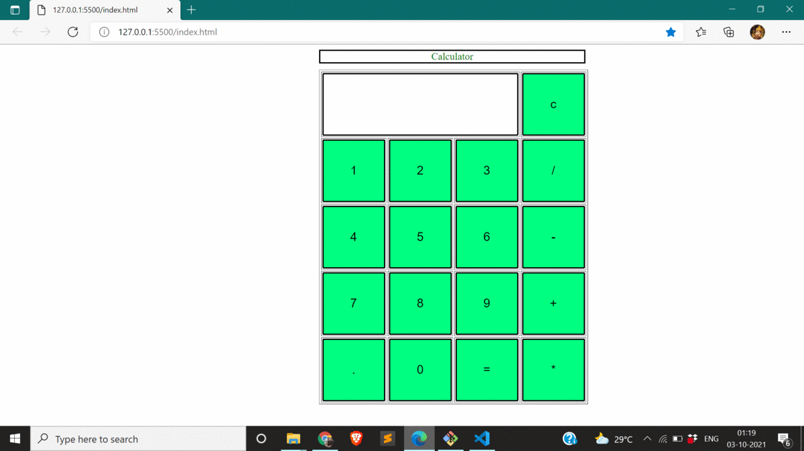

# HTML CALCULATOR

BASIC HTML CALCULATOR TO PERFORM CALCULATION

## Documentation

* STEP 1 -> ENTER THE INPUT (ONLY NUMBERS)
* STEP 2 -> ENTER THE OPERANDS
* PERFORMS THE CALCULATIONS
* YOU CAN DO ADDITION SUBSTRACTION MULTIPLICATION DIVISION

  
## DEMO

  

  