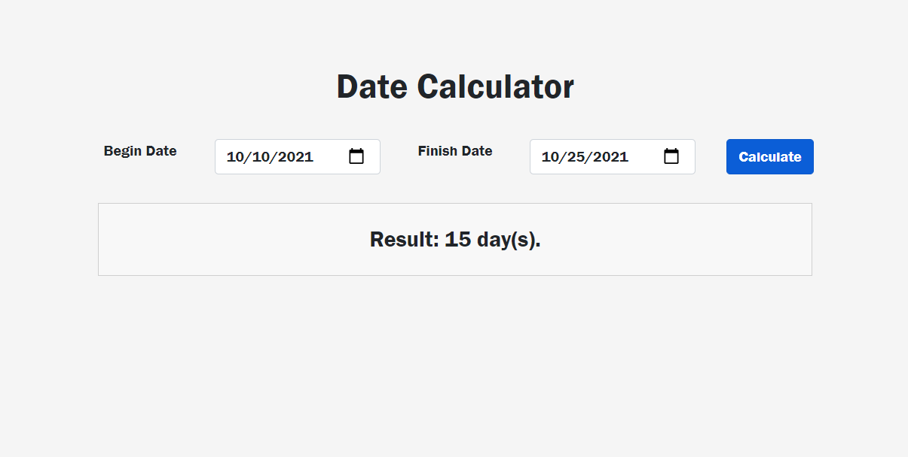

# Date Calculator
## Calculate days between two dates
User can select two dates and calculate the days between them.

  
## Screenshot

  

  
## Features

- Simple interface
- Responsive

  
## Improvement ideas

- Sum days, months, or years in a date.
- Option to count only work days.

  
## Technologies

- HMTL5
- CSS
- Bootstrap
- Javascritp
